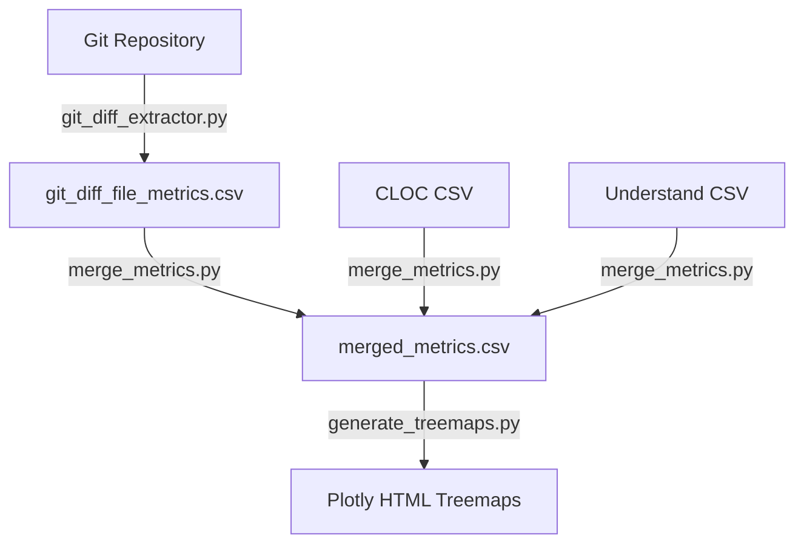

# Report Analysis & Git Diff Treemap Visualizer

本リポジトリは、以下の2つの主要な解析・可視化機能を提供します。

1. **統合静的解析レポート生成**: `understand` (UND), `cloc`, `pmd`, `git diff` の解析結果を統合し、プロジェクト全体のサマリと可視化を生成します。
2. **Git 差分 & メトリクス統合ツリーマップ可視化**: Gitの差分情報をベースに、CLOCやUnderstandの各種メトリクスを安全にマージし、Plotlyを用いたインタラクティブなツリーマップ（HTML形式）を生成します。

---

## Quick Reference

```bash
# 統合静的解析レポートの生成（全入力）
python3 src/report_analysis.py \
  sample_data/und_metrics.csv \
  sample_data/cloc/cloc.csv \
  "sample_data/pmd/*.xml" \
  sample_data/git_numstat.tsv \
  out/report "/"

# Git 差分 & メトリクス統合ツリーマップの生成
bash src/run_git_diff_treemap.sh HEAD~1 out/treemap \
  --git-dir analysis_code/Open3D \
  --cloc-csv sample_data/cloc/cloc.csv \
  --und-csv sample_data/und_metrics.csv \
  --algo add --extensions "cpp,c,cs,h,hpp"

# テスト実行
bash tests/run_tests.sh

# cloc の実行（入力データ準備用）
cloc --by-file --csv -out=${OUT_DIR}/cloc.csv ${SRC_DIR}
```

---

## 環境準備

Python 3.9 以上が必要です（3.12 推奨）。

```bash
python3 -m venv venv
source venv/bin/activate
pip install -r requirements.txt
```

---

## 使用方法

### 1. 統合静的解析レポート生成 (`report_analysis.py`)

指定された各種解析ツールの出力ファイルから、統合された解析結果を `OUTPUT_DIR` に出力します。  
各入力は省略可能で、存在する入力のみで処理を実行します（部分実行）。

#### コマンド書式

```bash
python3 src/report_analysis.py \
  {UND_CSV|none} \
  {CLOC_CSV|none} \
  {PMD_XML_GLOB_OR_LIST|none} \
  {GIT_NUMSTAT|none} \
  {OUTPUT_DIR} \
  {REMOVE_PATH_PREFIX}
```

#### 引数

| 引数 | 説明 |
|---|---|
| `UND_CSV` | Understand から出力したメトリクス CSV。`none` で省略。 |
| `CLOC_CSV` | cloc から出力した CSV。`none` で省略。 |
| `PMD_XML_GLOB_OR_LIST` | PMD CPD の XML ファイル。glob（`*.xml`）や区切りリスト（`,` / `:`）で複数指定可。`none` で省略。 |
| `GIT_NUMSTAT` | `git diff --numstat` 形式のテキストファイル。`none` で省略。 |
| `OUTPUT_DIR` | 出力先ディレクトリ（未存在時は自動作成）。 |
| `REMOVE_PATH_PREFIX` | パス正規化時に除去するプレフィックス。 |

#### 実行例

```bash
# 全入力を指定
python3 src/report_analysis.py \
  sample_data/und_metrics.csv \
  sample_data/cloc/cloc.csv \
  "sample_data/pmd/*.xml" \
  sample_data/git_numstat.tsv \
  out/report "/"

# UND のみで実行
python3 src/report_analysis.py \
  sample_data/und_metrics.csv \
  none none none out/report "/"

# PMD のみで実行
python3 src/report_analysis.py \
  none none "sample_data/pmd/*.xml" none out/report "/"
```

#### 主要な出力物

| 出力先 | 内容 |
|---|---|
| `OUTPUT_DIR/summary_report.csv` | 全体タスクサマリ |
| `OUTPUT_DIR/metrics_merge.csv` | 全ツール結果の統合マージ（`File` 列で外部結合） |
| `OUTPUT_DIR/und/` | Understand 解析結果（CSV、Treemap HTML） |
| `OUTPUT_DIR/cloc/` | CLOC 解析結果（言語比率円グラフ等） |
| `OUTPUT_DIR/pmd/` | PMD 解析結果（clone ratio CSV、Treemap HTML） |
| `OUTPUT_DIR/git/` | Git diff 解析結果（ファイル別 CSV、サマリ CSV） |

#### 終了コード

- `0`: 1つ以上の入力が処理された
- `1`: 引数不正 / 全入力が無効 / 全タスク失敗

---

### 2. Git 差分 & メトリクス統合ツリーマップ生成 (`run_git_diff_treemap.sh`)

指定したGitコミットやタグとの差分を集計し、CLOCやUnderstandのメトリクスを安全にマージした上で、インタラクティブなHTMLツリーマップ群を生成します。

#### コマンド書式

```bash
bash src/run_git_diff_treemap.sh {BASE_REF} {OUTPUT_DIR} [options]
```

- **`BASE_REF`** – 比較元となるコミットハッシュやタグ（例: `HEAD~1`, `v1.0.0`）。
- **`OUTPUT_DIR`** – CSVやHTMLレポートの出力先ディレクトリ。

#### 主要オプション

| オプション | 説明 |
|---|---|
| `--git-dir <path>` | 対象の Git リポジトリのパス（デフォルト: `.`） |
| `--target-ref <ref>` | 比較先のタグ/コミットID/ブランチ（デフォルト: `HEAD`） |
| `--worktree` | 現在の作業ツリーを比較先として差分を抽出 |
| `--cloc-csv <path>` | CLOC の CSV ファイルをマージ対象に指定 |
| `--und-csv <path>` | Understand の CSV ファイルをマージ対象に指定 |
| `--algo <add\|delete\|add+delete>` | 差分の集計アルゴリズム（デフォルト: `add+delete`） |
| `--extensions <ext1,ext2,...>` | 対象ファイル拡張子の制限。`all` で制限解除 |
| `--treemap-max-depth <int>` | ツリーマップの最大表示階層（デフォルト: `8`） |
| `--exclude <glob>` | 除外 glob パターンの追加指定 |
| `--no-progress` | 処理進捗のログ表示を無効化 |

#### 主な出力ファイル

| ファイル | 内容 |
|---|---|
| `git_diff_file_metrics.csv` | ファイル単位のGit差分メトリクス（追加・削除・変更行数、変更率） |
| `git_diff_summary.csv` | Git差分全体の集計サマリ |
| `merged_metrics.csv` | Git差分 + CLOC + Understand を統合したメトリクス |
| `index.html` | 各種ツリーマップHTMLへのポータル |
| `code_total_lines_treemap.html` | コード総行数（面積）× 変更率（色） |
| `changed_lines_count_treemap.html` | コード総行数（面積）× 変更行数（色） |
| `changed_lines_treemap.html` | 変更行数（面積） |

---

## テスト

受け入れ基準（AC-01〜AC-09）を自動検証するテストスイートを提供しています。  
テスト仕様の詳細は [docs/requirements.md](docs/requirements.md) の「7. 受け入れ基準」を参照してください。

### テスト実行

```bash
# 全テスト実行
bash tests/run_tests.sh

# 個別テスト指定（スペース区切りで複数可）
bash tests/run_tests.sh ac01 ac05

# テスト一覧の表示
bash tests/run_tests.sh --list
```

### テスト一覧

| ID | テストファイル | 検証内容 |
|---|---|---|
| ac01 | `test_ac01_und_path_normalization.sh` | UND CSV の Windows 形式パスが `/` に正規化される |
| ac02 | `test_ac02_cloc_output.sh` | CLOC 入力で pie chart HTML と CSV が生成される |
| ac03 | `test_ac03_pmd_integration.sh` | 複数 PMD XML が統合解析される |
| ac04 | `test_ac04_partial_input.sh` | 一部入力のみで正常終了する（部分実行） |
| ac05 | `test_ac05_all_none.sh` | 全入力なしで終了コード 1 を返す |
| ac06 | `test_ac06_merge_prefix.sh` | `metrics_merge.csv` にツール別プレフィックスが付与される |
| ac07 | `test_ac07_git_treemap.sh` | Git diff treemap が CSV + HTML を出力する |
| ac08 | `test_ac08_git_worktree.sh` | `--worktree` で作業ツリー差分が検出される |
| ac09 | `test_ac09_invalid_ref.sh` | 不正 Base Ref で終了コード 1 + エラー出力 |

---

## ドキュメント

| ファイル | 内容 |
|---|---|
| [docs/requirements.md](docs/requirements.md) | 要求仕様書（機能要求・非機能要求・受け入れ基準） |
| [docs/design.md](docs/design.md) | 実行設計書（アーキテクチャ・データモデル・処理シーケンス） |

---

## ディレクトリ構成

```text
hc_new_arch/
├── README.md                          # 本ドキュメント
├── requirements.txt                   # 依存ライブラリ
├── docker-compose.yml                 # コンテナ実行用構成
├── Dockerfile                         # コンテナイメージビルド用
├── docs/
│   ├── requirements.md                # 要求仕様書
│   └── design.md                      # 実行設計書
├── tests/
│   ├── run_tests.sh                   # テストランナー
│   ├── test_helpers.sh                # テスト共通ヘルパー関数
│   └── test_ac{01-09}_*.sh            # 受け入れ基準別テスト
├── sample_data/                       # テスト・サンプルデータ群
│   ├── cloc/cloc.csv
│   ├── pmd/*.xml
│   ├── und_metrics.csv
│   └── git_numstat.tsv
└── src/
    ├── report_analysis.py             # 統合レポートオーケストレーター
    ├── analyzers.py                   # UND/CLOC/PMD/Git の解析ロジック
    ├── io_models.py                   # I/O モデルと入力解決処理
    ├── advanced_visualizations.py     # 高度な可視化処理
    ├── run_git_diff_treemap.sh        # Git差分ツリーマップ CLI エントリ
    ├── git_diff_extractor.py          # Git差分情報の抽出
    ├── merge_metrics.py               # 複数メトリクスCSVの安全なマージ
    ├── generate_treemaps.py           # Plotly ツリーマップ HTML の生成
    └── plotly_visualize.py            # Plotly 汎用可視化ユーティリティ
```

---

## アーキテクチャ

### 統合静的解析レポート (`report_analysis.py`)

`report_analysis.py` がオーケストレータとなり、`io_models.py` で入力パスを解決・前処理した上で、`analyzers.py` の各種解析モジュールを逐次実行します。各モジュールは独立しており、新規ツールの追加は `analyzers.py` に関数1つ、`report_analysis.py` に1行追加するだけで完了します。

### Git差分ツリーマップ (`run_git_diff_treemap.sh`)

関心の分離（Separation of Concerns）と中間データの可観測性（Observability）向上のため、処理が**3つの独立したPythonスクリプト**に分割・設計されています。



#### Phase 1: 差分抽出 (`git_diff_extractor.py`)
Gitのコミット/タグ差分から、ファイル単位の追加・削除・合計の変更行数およびベース行数を抽出し、`git_diff_file_metrics.csv` として出力します。

#### Phase 2: 安全な複数CSVマージ (`merge_metrics.py`)
Git差分データ、CLOCデータ、Understandデータなどの多様なCSVをパスベースで結合し、`merged_metrics.csv` を作成します。以下の安全対策を備えています。

- **明示的なプレフィックス指定削除による名寄せ (`--strip-prefix`)**: 後方一致（Suffix Match）による同名ファイル誤結合を防ぎ、前方一致で安全にパスを正規化します。
- **列名の衝突防止**: ジョインキー（`File`）以外の列に自動プレフィックス（`cloc_`、`und_` 等）を付与します。
- **Understand `Kind` カラムフィルタリング**: `Kind` が `"File"` の行のみを抽出し、関数/クラス行の混入によるデカルト積を防止します。

#### Phase 3: ツリーマップ生成 (`generate_treemaps.py`)
結合された `merged_metrics.csv` から Plotly を用いてツリーマップを構築します。CLOCやUnderstandからマージされた総行数カラム（`cloc_code` 等）を動的に認識し、高精度な物理行数を優先的に利用して変更率を補正計算します。
