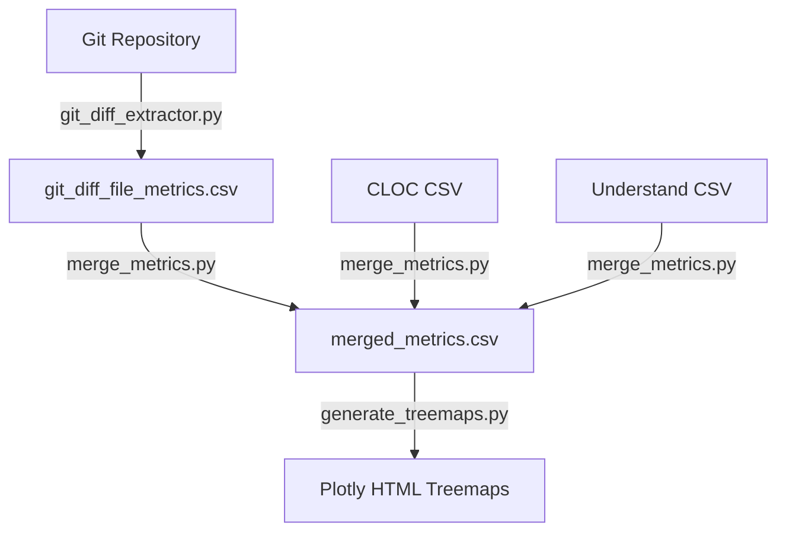

# Report Analysis & Git Diff Treemap Visualizer

本リポジトリは、以下の2つの主要な解析・可視化機能を提供します。

1. **統合静的解析レポート生成**: `understand` (UND), `cloc`, `pmd` の解析結果を統合し、プロジェクト全体のサマリと可視化を生成します。
2. **Git 差分 & メトリクス統合ツリーマップ可視化**: Gitの差分情報をベースに、CLOCやUnderstandの各種メトリクスを安全にマージし、Plotlyを用いたインタラクティブなツリーマップ（HTML形式）を生成します。

---

## Quic Reference

### 1. 統合静的解析レポートの生成
```bash
# 統合静的解析レポートの生成
python3 src/report_analysis.py sample_data/und_metrics.csv sample_data/cloc/cloc.csv "sample_data/pmd/*.xml" out/report /home/korver/code/hc_new_arch

# Git 差分 & メトリクス統合ツリーマップの生成
bash src/run_git_diff_treemap.sh HEAD~1 out/treemap --git-dir analysis_code/Open3D --cloc-csv sample_data/cloc/cloc.csv --und-csv sample_data/und_metrics.csv --algo add --extensions "cpp,c,cs,h,hpp"

# cloc
cloc --by-file --csv -out=${OUT_DIR}/cloc.csv ${SRC_DIR}
```

---

## 使用方法

### 環境準備
Python 3.12 以上が推奨されます。必要なライブラリは `requirements.txt` からインストールしてください。
```bash
pip install -r requirements.txt
```

### 1. 統合静的解析レポート生成 (`report_analysis.py`)
指定された各種解析ツールのファイル（省略時は `none` を指定可能）から、統合された解析結果を `OUTPUT_DIR` に出力します。

#### コマンド書式
```bash
python3 src/report_analysis.py \
  {UND_CSV|none} \
  {CLOC_CSV|none} \
  {PMD_XML_GLOB_OR_LIST|none} \
  {OUTPUT_DIR} \
  {REMOVE_PATH_PREFIX}
```

- **`UND_CSV`** – Understand から出力したメトリクス CSV ファイル。
- **`CLOC_CSV`** – cloc から出力したメトリクス CSV ファイル。
- **`PMD_XML_GLOB_OR_LIST`** – PMD から出力した XML ファイルのパス（glob形式や区切りリスト形式での複数指定に対応）。
- **`OUTPUT_DIR`** – 統合レポートを出力するディレクトリ（存在しない場合は自動生成）。
- **`REMOVE_PATH_PREFIX`** – ファイルパスから一貫して削除する共通プレフィックス（任意）。

#### 出力物
- `OUTPUT_DIR/summary_report.csv` – 全体タスクサマリ
- `OUTPUT_DIR/und/` – Understand 解析結果（フィルタリング済みのCSV、ツリーマップ等）
- `OUTPUT_DIR/cloc/` – CLOC 解析結果（言語比率円グラフ等）
- `OUTPUT_DIR/pmd/` – PMD 解析結果

---

### 2. Git 差分 & メトリクス統合ツリーマップ生成 (`run_git_diff_treemap.sh`)
指定したGitコミットやタグとの差分を集計し、CLOCやUnderstandのメトリクスを安全にマージした上で、インタラクティブなHTMLツリーマップ群を生成します。

#### コマンド書式
```bash
bash src/run_git_diff_treemap.sh {BASE_REF} {OUTPUT_DIR} [options]
```

- **`BASE_REF`** – 比較元となるコミットハッシュやタグ（例: `HEAD~1`, `v1.0.0`）。
- **`OUTPUT_DIR`** – CSVやHTMLレポートの出力先ディレクトリ。

#### 主要オプション
- `--git-dir <path>`: 対象の Git リポジトリのパスを指定（デフォルト: `.`）。
- `--worktree`: 現在の作業ツリーを比較先として差分を抽出します。
- `--cloc-csv <path>`: CLOC の CSV ファイルをマージ対象に指定。
- `--und-csv <path>`: Understand の CSV ファイルをマージ対象に指定。
- `--algo <add|delete|add+delete>`: 差分の集計アルゴリズムを選択（デフォルト: `add`）。
- `--extensions <ext1,ext2,...>`: 解析対象のファイル拡張子をカンマ区切りで制限。
- `--treemap-max-depth <int>`: ツリーマップの最大表示階層（デフォルト: `8`）。
- `--no-progress`: 処理進捗のログ表示を無効化。

#### 主な出力ファイル
- `git_diff_file_metrics.csv` – ファイル単位のGit差分メトリクス（追加・削除・変更行数、変更率など）。
- `git_diff_summary.csv` – Git差分全体の集計サマリ。
- `merged_metrics.csv` – Git差分、CLOC、Understand（und）を結合・パス名寄せした統合メトリクス。
- `index.html` – 出力された以下の各種ツリーマップHTMLへのポータル：
  - `code_total_lines_treemap.html` – コード総行数（面積）× 変更率（色）
  - `changed_lines_count_treemap.html` – 変更行数（面積）× 変更行数（色）
  - `changed_lines_treemap.html` – 変更行数（面積）のみ

---

## 設計

### ディレクトリ構成
```text
hc_new_arch/
├── README.md                      # 本ドキュメント
├── requirements.txt               # 必要な依存ライブラリ
├── docker-compose.yml             # コンテナ実行用構成
├── Dockerfile                     # コンテナイメージビルド用
├── sample_data/                   # テスト・サンプルデータ群
│   ├── cloc/
│   ├── und_metrics.csv
│   └── pmd/
└── src/
    ├── run_git_diff_treemap.sh    # Git差分ツリーマップ CLI エントリ
    ├── git_diff_extractor.py      # 【Phase 1】Git差分情報の抽出
    ├── merge_metrics.py           # 【Phase 2】複数メトリクスCSVの安全なマージ
    ├── generate_treemaps.py       # 【Phase 3】PlotlyツリーマップHTMLの生成
    ├── report_analysis.py         # 静的解析レポート生成のメインロジック
    ├── analyzers.py               # UND/CLOC/PMDの個別静的解析ロジック
    └── io_models.py               # 静的解析用I/Oモデルと解決処理
```

### アーキテクチャ設計

#### 1. 統合静的解析レポート (`report_analysis.py`)
`report_analysis.py` がオーケストレータとなり、`io_models.py` で入力パスを解決・前処理した上で、`analyzers.py` の各種解析モジュールを逐次実行します。各モジュールは独立しており、新規ツールの追加や設定の変更が容易な拡張性の高い設計です。

#### 2. Git差分ツリーマップ (`run_git_diff_treemap.sh`)
関心の分離（Separation of Concerns）と中間データの可観測性（Observability）向上のため、処理が**3つの独立したPythonスクリプト**に分割・設計されています。



##### 【Phase 1】 差分抽出 (`git_diff_extractor.py`)
Gitのコミット/タグ差分から、ファイル単位の追加（add）、削除（delete）、合計（add+delete）などの変更行数およびベース行数を抽出し、`git_diff_file_metrics.csv` として出力します。

##### 【Phase 2】 安全な複数CSVマージ (`merge_metrics.py`)
Git差分データ、CLOCデータ、Understandデータなどの多様なCSVをパスベースで結合し、`merged_metrics.csv` を作成します。以下の安全対策・整合性維持機構を備えています。

* **明示的なプレフィックス指定削除による名寄せ (`--strip-prefix`)**:
  後方一致（Suffix Match）は、別フォルダに存在する同名ファイル（例: `src/utils.py` と `tests/utils.py`）を誤って同一とみなすリスクがあります。これを防ぐため、`\` の `/` への統一および、指定されたプレフィックス（絶対パスやサブディレクトリなど）のみを前方一致で確実に削除する設計を採用し、安全かつ確実なパス名寄せを実現しています。
* **列名の衝突防止**:
  結合する各CSVのカラム（ジョインキーである `File` 以外）に対し、自動的にCSVファイル名や指定したプレフィックス（例: `cloc_` や `und_`）を付与してリネームし、カラム名の衝突を防ぎます。
* **Understand `Kind` カラムフィルタリング**:
  Understandから抽出したCSVには、ファイル単位のメトリクスだけでなく、関数やクラス単位のメトリクス行が含まれています。これらを単純結合すると、多重マッチによるデカルト積（カーテシアン積）が生じ、マージ結果の行数が著しく肥大化します。
  本スクリプトは、CSVに `Kind`/`kind` カラムが存在する場合、**値が `"File"` の行のみ**を抽出してマージ対象とするフィルタリング機構を内蔵しており、ファイル単位の厳密なマージ整合性を維持します。

##### 【Phase 3】 ツリーマップ生成 (`generate_treemaps.py`)
結合された `merged_metrics.csv` から Plotly を用いてツリーマップを構築します。CLOCやUnderstandからマージされた総行数カラム（`cloc_code`等）を動的に認識し、Gitから抽出された `TotalLines` よりも高精度な物理行数を優先的に利用して変更率などを補正計算する、データ可視化エンジンを搭載しています。
