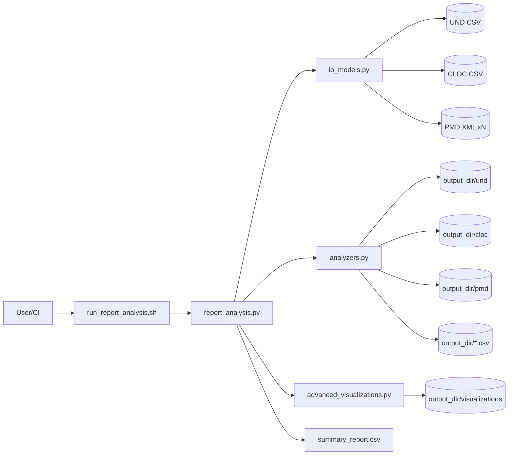
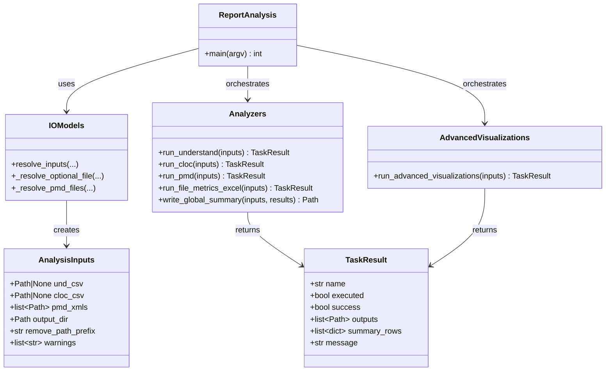
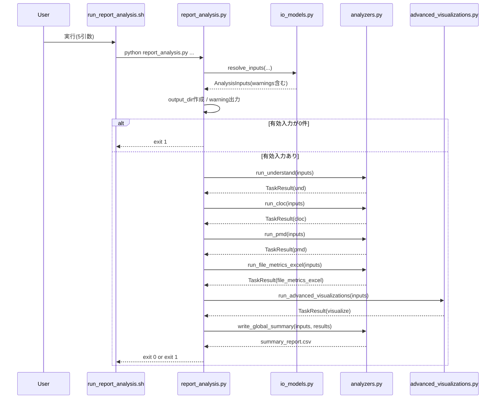
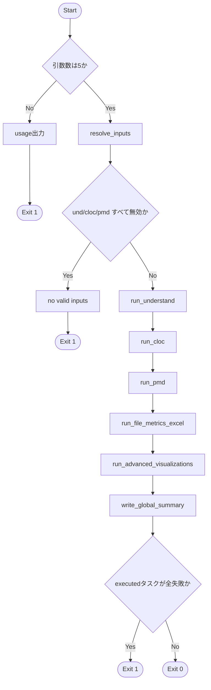
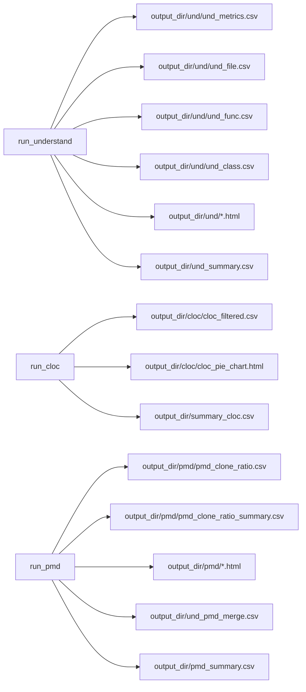

# 新アーキテクチャ実行設計: report analysis

## 1. 目的

本設計書は、[RUN_REPORT_ANALYSIS_REQUIREMENTS.md](/workspace/new_arch/RUN_REPORT_ANALYSIS_REQUIREMENTS.md) を実現するための実行設計を定義する。  
本設計では **既存 `scripts/*` のコードを利用しない** ことを前提とし、`new_arch` 配下のみで完結する新規実装とする。

優先順位は以下とする。

1. 拡張性
2. 可読性
3. コード行数の少なさ

## 2. 設計方針

- Shell は薄い入口として維持し、処理本体は Python に集約する。
- UND/CLOC/PMD は同一オーケストレーターから呼び出し、部分実行を標準動作にする。
- 既存スクリプトの呼び出し・import は行わない。
- 分割粒度は「理解コスト削減」と「将来追加容易性」のバランスで決める。

## 3. ディレクトリ/ファイル構成

```text
new_arch/
  run_report_analysis.sh          # CLI入口（薄い）
  report_analysis.py              # オーケストレーター本体
  analyzers.py                    # UND/CLOC/PMD の新規解析実装
  io_models.py                    # 入力解決・設定・結果モデル（dataclass）
  README.md                       # 実行方法・入出力説明
  RUN_REPORT_ANALYSIS_REQUIREMENTS.md
  RUN_REPORT_ANALYSIS_DESIGN.md
```

## 4. CLI インターフェース設計

## 4.1 実行形式

```bash
bash new_arch/run_report_analysis.sh \
  {UND_CSV|none} \
  {CLOC_CSV|none} \
  {PMD_XML_GLOB_OR_LIST|none} \
  {OUTPUT_DIR} \
  {REMOVE_PATH_PREFIX}
```

## 4.2 引数解釈

1. `UND_CSV|none`
2. `CLOC_CSV|none`
3. `PMD_XML_GLOB_OR_LIST|none`
4. `OUTPUT_DIR`
5. `REMOVE_PATH_PREFIX`

- `none` / `false` / `-` は未指定扱い。
- `PMD_XML_GLOB_OR_LIST` は以下を許容:
  - glob 文字列（例: `sample_data/pmd/*.xml`）
  - 区切りリスト（`,` or `:`）
- パス解決後に実在ファイルのみ有効入力として扱う。

## 5. 論理アーキテクチャ

```text
run_report_analysis.sh
  -> report_analysis.py
      -> io_models.resolve_inputs()
      -> analyzers.run_understand()   [if UND exists]
      -> analyzers.run_cloc()         [if CLOC exists]
      -> analyzers.run_pmd()          [if PMD list non-empty]
      -> analyzers.write_global_summary()
```

## 5.1 UML: コンポーネント図



## 5.2 コアデータモデル

`io_models.py` で以下の dataclass を定義する。

- `AnalysisInputs`
  - `und_csv: Optional[Path]`
  - `cloc_csv: Optional[Path]`
  - `pmd_xmls: list[Path]`
  - `output_dir: Path`
  - `remove_path_prefix: str`
  - `warnings: list[str]`（未存在入力など）

- `TaskResult`
  - `name: str`（`und` / `cloc` / `pmd`）
  - `executed: bool`
  - `success: bool`
  - `outputs: list[Path]`
  - `message: str`

## 5.3 UML: クラス図



## 6. 処理シーケンス設計

## 6.1 前処理

1. 引数数チェック
2. `OUTPUT_DIR` 作成
3. UND/CLOC/PMD 入力解決
4. 全入力未指定または未存在なら `exit 1`

## 6.1.1 UML: メインシーケンス図



## 6.2 UND 解析（新規実装）

- 入力: UND CSV（1ファイル）
- 処理:
  - CSV読込
  - `File` / `LongName` の区切り文字正規化（`\\` -> `/`）
  - `REMOVE_PATH_PREFIX` の除去
  - `Kind` に基づく `File/Function/Class` 分割
  - 集計サマリ作成
  - treemap HTML 作成
- 出力先:
  - `OUTPUT_DIR/und/`
  - `OUTPUT_DIR/und/`
  - `OUTPUT_DIR/und_summary.csv`

## 6.3 CLOC 解析（新規実装）

- 入力: CLOC CSV（1ファイル）
- 処理:
  - 必須列検証（`language, filename, blank, comment, code`）
  - `SUM` 行除外
  - ファイルパス正規化
  - 言語別 pie chart 生成
  - サマリ作成
- 出力先:
  - `OUTPUT_DIR/cloc/`
  - `OUTPUT_DIR/summary_cloc.csv`

## 6.4 PMD 解析（新規実装）

- 入力: PMD XML（複数）
- 処理:
  - XMLを `xml.etree.ElementTree` で解析
  - `file` / `duplication` 情報からファイルごとの clone token を算出
  - 複数XMLを統合集計
  - clone ratio CSV / summary CSV / treemap 生成
  - UND入力がある場合は UND/PMD マージCSVと summary作成
- 出力先:
  - `OUTPUT_DIR/pmd/`
  - `OUTPUT_DIR/und_pmd_merge.csv`（条件付き）
  - `OUTPUT_DIR/pmd_summary.csv`（条件付き）

## 6.5 統合サマリ

- タスク実行結果を `summary_report.csv` として `OUTPUT_DIR` 直下に保存する。

## 6.6 UML: アクティビティ図（終了コード判定）



## 6.7 UML: UND/CLOC/PMD 出力マッピング図



## 7. エラー/終了コード設計

- `exit 0`: 1つ以上の解析が実行され、全実行タスクが失敗でない
- `exit 1`: 以下のいずれか
  - 引数不正
  - 入力がすべて無効
  - 実行対象タスクがすべて失敗

## 8. ログ設計

- ログ形式:
  - `[INFO]`
  - `[WARN]`
  - `[ERROR]`
- 必須ログ:
  - 入力解決結果
  - スキップ理由（未指定/未存在）
  - タスクごとの結果
  - summary出力先

## 9. 拡張性設計

- 新規解析追加は `analyzers.py` に `run_<name>()` を1関数追加し、`report_analysis.py` の実行リストへ1行追加する。
- 入力種別追加は `io_models.py` の解決ロジックに追記する。

## 10. 可読性/コード量最適化指針

- 早期 return と dataclass 利用で分岐を平坦化する。
- 文字列連結より `Path` と DataFrame 操作を優先する。
- パス正規化ロジックを共通化して重複を削減する。
- 4ファイル構成を維持し、過分割を避ける。

## 11. テスト設計（最小）

- 単体:
  - 入力解決（none/未存在/glob/複数XML）
  - PMD XML解析（複製トークン算出）
- 結合:
  - UNDのみ
  - CLOCのみ
  - PMDのみ（複数XML）
  - UND+CLOC+PMD
  - 一部未存在
  - 全未存在（exit 1）

## 12. 実装制約

- `new_arch` は `scripts/*` に依存しない単独実装とする。
- 必要ライブラリは `pandas` / `plotly` / 標準ライブラリを使用する。
